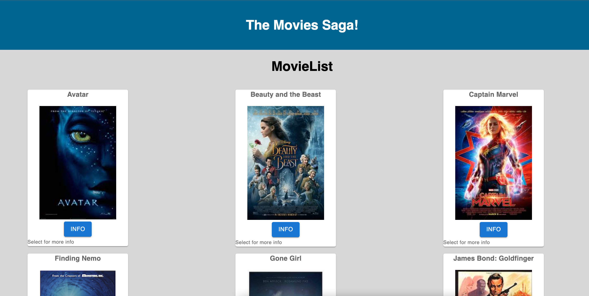
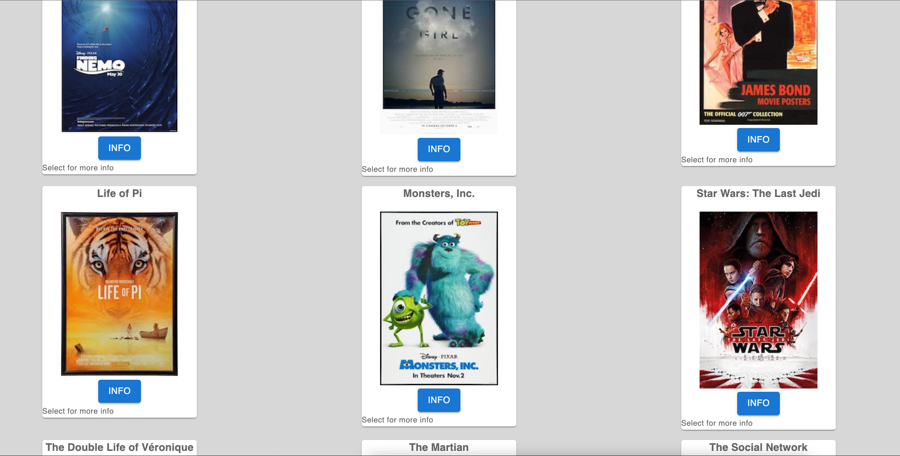
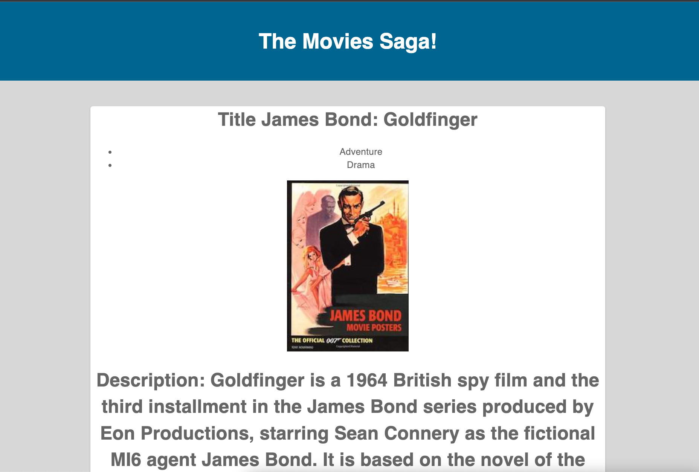

# Movie App: React-Redux with Redux-Sagas

## Movie App

This is amovie management application! users are to see movies that exist in our DB, they are also able to see detailed view for each individual movie, including all genres associated with that movie. 

## Database Setup

1. Create a database named `saga_movies_weekend`
2. Run the queries from `database.sql` on the `saga_movies_weekend` database

## Install Dependencies

1. `npm install`
2. `npm run server`
3. `npm run client`

### Home / List Page

This view displays all of the movies in the movie database. 

 When a movie info button is clicked, a user goes the `/details` view for that movie.

 - Home page

### Details Page

This shows all details **including ALL genres** for the selected movie, including title, description, and the image, too! 

- The details page has a `Back to List` button, which brings the user to the Home/List Page.

- Details page

## Credits

This project was based on an activitie from Prime Academy.
